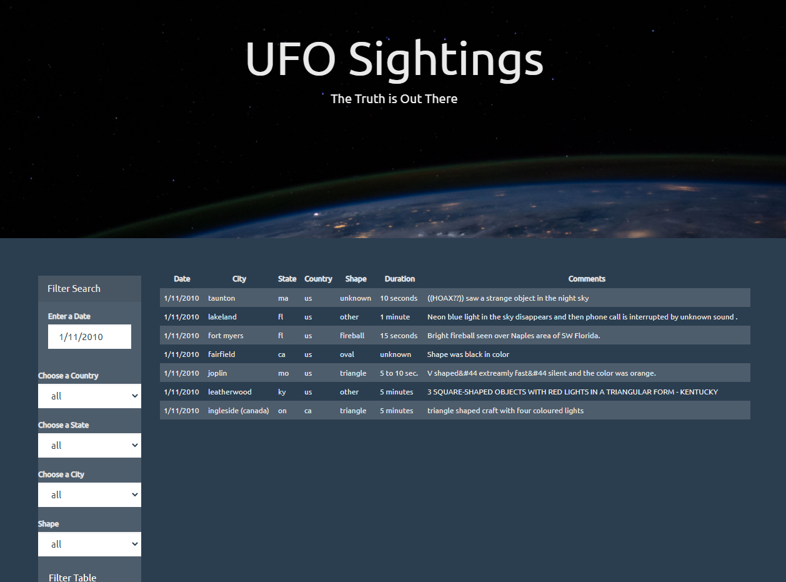

# javascript-DOM

In this project, I used UFO Sightings Data with JavaScript, HTML, CSS, D3.js to build web pages.

### Automatic Table and Date Scearch
- A basic HTML web page (index.html) is built with forms and tables.
- The data.js file is imported to app.js and filtered by the user selected date from the html form.
- A detialed table is also appended to the web page with information on date/time, city, state, country, shape, and comment.

### Multiple Search Categories
Four dropdowns were added to the above HTML to enable multiple filters and search for UFO sightings using up to 5 critieria includes date/time, city, state, country, and shape.

